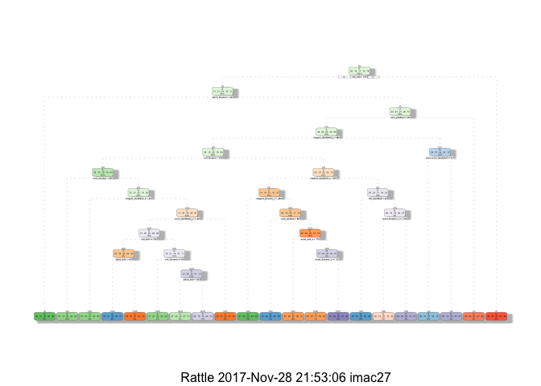
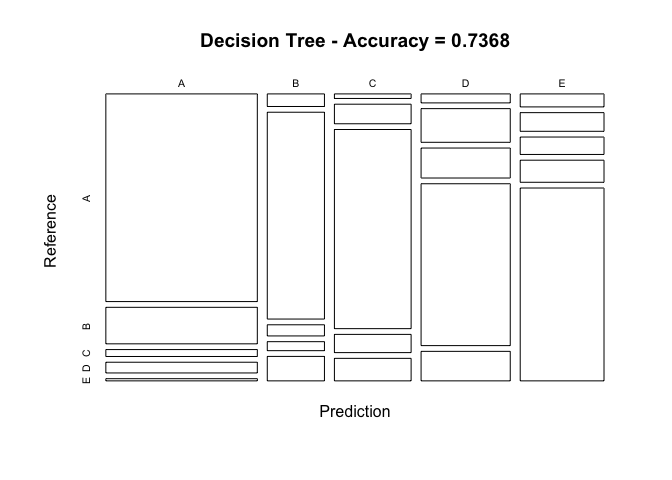
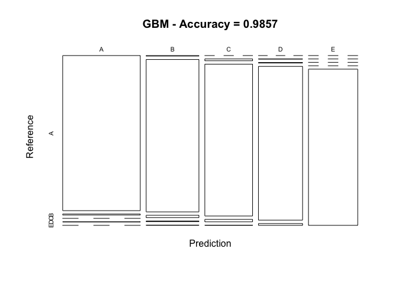

# Practical Machine Learning: Prediction Assignment Writeup
Ben Karmay  
25/11/2017  

##SYNOPSIS

Human Activity Recognition (HAR) is a key research area that is gaining increasing attention, especially for the development of context-aware systems. There are many potential applications for HAR, like: elderly monitoring, life log systems for monitoring energy expenditure and for supporting weight-loss programs, and digital assistants for weight lifting exercises. Using devices such as Jawbone Up, Nike FuelBand, and Fitbit it is now possible to collect a large amount of data about personal activity relatively inexpensively.

Six participants were asked to perform one set of 10 repetitions of the Unilateral Dumbbell Biceps Curl in five different fashions: exactly according to the specification (Class A), throwing the elbows to the front (Class B), lifting the dumbbell only halfway (Class C), lowering the dumbbell only halfway (Class D) and throwing the hips to the front (Class E).

This report will describe how the data captured are used to identify the parameters involved in predicting the movement involved based on the above classification, and then to predict the movement for 20 test cases.

The training data were divided into two groups, a training data and a validation data (to be used to validate the data), to derived the prediction model by using the training data, to validate the model where an expected out-of-sample error rate of less than 0.5%, or 99.5% accuracy, would be acceptable before it is used to perform the prediction on the 20 test cases - that must have 100% accuracy (to obtain 20 points awarded).

The training model developed using Random Forest was able to achieve over 99.99% accuracy, or less than 0.03% out-of-sample error, and was able to predict the 20 test cases with 100% accuracy.


####Check if the data files exist. If not, download it from the URL. When reading in the file, change invalid values to NA.

The training data for this project are available here:

https://d396qusza40orc.cloudfront.net/predmachlearn/pml-training.csv

The test data are available here:

https://d396qusza40orc.cloudfront.net/predmachlearn/pml-testing.csv

The data for this project come from http://groupware.les.inf.puc-rio.br/har.

####Load required packages and set seed.


```r
library(knitr)
library(caret)
```

```
## Loading required package: lattice
```

```
## Loading required package: ggplot2
```

```r
library(rpart)
library(rpart.plot)
library(rattle)
```

```
## Rattle: A free graphical interface for data mining with R.
## Version 5.0.14 Copyright (c) 2006-2017 Togaware Pty Ltd.
## Type 'rattle()' to shake, rattle, and roll your data.
```

```r
library(randomForest)
```

```
## randomForest 4.6-12
```

```
## Type rfNews() to see new features/changes/bug fixes.
```

```
## 
## Attaching package: 'randomForest'
```

```
## The following object is masked from 'package:ggplot2':
## 
##     margin
```

```r
library(corrplot)
```

```
## corrplot 0.84 loaded
```

```r
set.seed(12345)
```

####Download and load data files for cleaning


```r
# set the URL for the download
UrlTrain <- "http://d396qusza40orc.cloudfront.net/predmachlearn/pml-training.csv"
UrlTest  <- "http://d396qusza40orc.cloudfront.net/predmachlearn/pml-testing.csv"

# download the datasets
training <- read.csv(url(UrlTrain))
testing  <- read.csv(url(UrlTest))

# create a partition with the training dataset 
inTrain  <- createDataPartition(training$classe, p=0.7, list=FALSE)
TrainSet <- training[inTrain, ]
TestSet  <- training[-inTrain, ]
dim(TrainSet)
```

```
## [1] 13737   160
```


```r
dim(TestSet)
```

```
## [1] 5885  160
```

Both created datasets have 160 variables. Those variables have plenty of NA, that can be removed with the cleaning procedures below. The Near Zero variance (NZV) variables are also removed and the ID variables as well.


```r
# remove variables with Nearly Zero Variance
NZV <- nearZeroVar(TrainSet)
TrainSet <- TrainSet[, -NZV]
TestSet  <- TestSet[, -NZV]
dim(TrainSet)
```

```
## [1] 13737   106
```


```r
dim(TestSet)
```

```
## [1] 5885  106
```


```r
# remove variables that are mostly NA
AllNA    <- sapply(TrainSet, function(x) mean(is.na(x))) > 0.95
TrainSet <- TrainSet[, AllNA==FALSE]
TestSet  <- TestSet[, AllNA==FALSE]
dim(TrainSet)
```

```
## [1] 13737    59
```


```r
dim(TestSet)
```

```
## [1] 5885   59
```


```r
# remove identification only variables (columns 1 to 5)
TrainSet <- TrainSet[, -(1:5)]
TestSet  <- TestSet[, -(1:5)]
dim(TrainSet)
```

```
## [1] 13737    54
```


```r
dim(TestSet)
```

```
## [1] 5885   54
```

With the cleaning process above, the number of variables for the analysis has been reduced to 54 only.

####Prediction Model Building

Three methods will be applied to model the regressions (in the Train dataset) and the best one (with higher accuracy when applied to the Test dataset) will be used for the quiz predictions. The methods are: Random Forests, Decision Tree and Generalized Boosted Model, as described below.

A Confusion Matrix is plotted at the end of each analysis to better visualize the accuracy of the models.

####Method: Random Forest


```r
# model fit
set.seed(12345)
controlRF <- trainControl(method="cv", number=3, verboseIter=FALSE)
modFitRandForest <- train(classe ~ ., data=TrainSet, method="rf",
                          trControl=controlRF)
modFitRandForest$finalModel
```

```
## 
## Call:
##  randomForest(x = x, y = y, mtry = param$mtry) 
##                Type of random forest: classification
##                      Number of trees: 500
## No. of variables tried at each split: 27
## 
##         OOB estimate of  error rate: 0.19%
## Confusion matrix:
##      A    B    C    D    E  class.error
## A 3904    1    0    0    1 0.0005120328
## B    6 2651    1    0    0 0.0026335591
## C    0    6 2390    0    0 0.0025041736
## D    0    0    8 2244    0 0.0035523979
## E    0    0    0    3 2522 0.0011881188
```


```r
# prediction on Test dataset
predictRandForest <- predict(modFitRandForest, newdata=TestSet)
confMatRandForest <- confusionMatrix(predictRandForest, TestSet$classe)
confMatRandForest
```

```
## Confusion Matrix and Statistics
## 
##           Reference
## Prediction    A    B    C    D    E
##          A 1674    5    0    0    0
##          B    0 1133    2    0    0
##          C    0    1 1024    7    0
##          D    0    0    0  957    4
##          E    0    0    0    0 1078
## 
## Overall Statistics
##                                          
##                Accuracy : 0.9968         
##                  95% CI : (0.995, 0.9981)
##     No Information Rate : 0.2845         
##     P-Value [Acc > NIR] : < 2.2e-16      
##                                          
##                   Kappa : 0.9959         
##  Mcnemar's Test P-Value : NA             
## 
## Statistics by Class:
## 
##                      Class: A Class: B Class: C Class: D Class: E
## Sensitivity            1.0000   0.9947   0.9981   0.9927   0.9963
## Specificity            0.9988   0.9996   0.9984   0.9992   1.0000
## Pos Pred Value         0.9970   0.9982   0.9922   0.9958   1.0000
## Neg Pred Value         1.0000   0.9987   0.9996   0.9986   0.9992
## Prevalence             0.2845   0.1935   0.1743   0.1638   0.1839
## Detection Rate         0.2845   0.1925   0.1740   0.1626   0.1832
## Detection Prevalence   0.2853   0.1929   0.1754   0.1633   0.1832
## Balanced Accuracy      0.9994   0.9972   0.9982   0.9960   0.9982
```

####Method: Decision Trees


```r
# model fit
set.seed(12345)
modFitDecTree <- rpart(classe ~ ., data=TrainSet, method="class")
fancyRpartPlot(modFitDecTree)
```

<!-- -->


```r
# prediction on Test dataset
predictDecTree <- predict(modFitDecTree, newdata=TestSet, type="class")
confMatDecTree <- confusionMatrix(predictDecTree, TestSet$classe)
confMatDecTree
```

```
## Confusion Matrix and Statistics
## 
##           Reference
## Prediction    A    B    C    D    E
##          A 1530  269   51   79   16
##          B   35  575   31   25   68
##          C   17   73  743   68   84
##          D   39  146  130  702  128
##          E   53   76   71   90  786
## 
## Overall Statistics
##                                          
##                Accuracy : 0.7368         
##                  95% CI : (0.7253, 0.748)
##     No Information Rate : 0.2845         
##     P-Value [Acc > NIR] : < 2.2e-16      
##                                          
##                   Kappa : 0.6656         
##  Mcnemar's Test P-Value : < 2.2e-16      
## 
## Statistics by Class:
## 
##                      Class: A Class: B Class: C Class: D Class: E
## Sensitivity            0.9140  0.50483   0.7242   0.7282   0.7264
## Specificity            0.9014  0.96650   0.9502   0.9100   0.9396
## Pos Pred Value         0.7866  0.78338   0.7543   0.6131   0.7305
## Neg Pred Value         0.9635  0.89051   0.9422   0.9447   0.9384
## Prevalence             0.2845  0.19354   0.1743   0.1638   0.1839
## Detection Rate         0.2600  0.09771   0.1263   0.1193   0.1336
## Detection Prevalence   0.3305  0.12472   0.1674   0.1946   0.1828
## Balanced Accuracy      0.9077  0.73566   0.8372   0.8191   0.8330
```


```r
# plot matrix results
plot(confMatDecTree$table, col = confMatDecTree$byClass, 
     main = paste("Decision Tree - Accuracy =",
                  round(confMatDecTree$overall['Accuracy'], 4)))
```

<!-- -->

####Method: Generalized Boosted Model


```r
# model fit
set.seed(12345)
controlGBM <- trainControl(method = "repeatedcv", number = 5, repeats = 1)
modFitGBM  <- train(classe ~ ., data=TrainSet, method = "gbm",
                    trControl = controlGBM, verbose = FALSE)
```

```
## Loading required package: survival
```

```
## 
## Attaching package: 'survival'
```

```
## The following object is masked from 'package:caret':
## 
##     cluster
```

```
## Loading required package: splines
```

```
## Loading required package: parallel
```

```
## Loaded gbm 2.1.3
```

```r
modFitGBM$finalModelinsta
```

```
## NULL
```


```r
# prediction on Test dataset
predictGBM <- predict(modFitGBM, newdata=TestSet)
confMatGBM <- confusionMatrix(predictGBM, TestSet$classe)
confMatGBM
```

```
## Confusion Matrix and Statistics
## 
##           Reference
## Prediction    A    B    C    D    E
##          A 1670   10    0    2    0
##          B    4 1116   17    5    2
##          C    0   12 1006   16    1
##          D    0    1    3  941   11
##          E    0    0    0    0 1068
## 
## Overall Statistics
##                                           
##                Accuracy : 0.9857          
##                  95% CI : (0.9824, 0.9886)
##     No Information Rate : 0.2845          
##     P-Value [Acc > NIR] : < 2.2e-16       
##                                           
##                   Kappa : 0.9819          
##  Mcnemar's Test P-Value : NA              
## 
## Statistics by Class:
## 
##                      Class: A Class: B Class: C Class: D Class: E
## Sensitivity            0.9976   0.9798   0.9805   0.9761   0.9871
## Specificity            0.9972   0.9941   0.9940   0.9970   1.0000
## Pos Pred Value         0.9929   0.9755   0.9720   0.9843   1.0000
## Neg Pred Value         0.9990   0.9951   0.9959   0.9953   0.9971
## Prevalence             0.2845   0.1935   0.1743   0.1638   0.1839
## Detection Rate         0.2838   0.1896   0.1709   0.1599   0.1815
## Detection Prevalence   0.2858   0.1944   0.1759   0.1624   0.1815
## Balanced Accuracy      0.9974   0.9870   0.9873   0.9865   0.9935
```


```r
# plot matrix results
plot(confMatGBM$table, col = confMatGBM$byClass, 
     main = paste("GBM - Accuracy =", round(confMatGBM$overall['Accuracy'], 4)))
```

<!-- -->

####Conclusion: 

Applying the Selected Model to the Test Data
The accuracy of the 3 regression modeling methods above are:

        Random Forest : 0.9963
        Decision Tree : 0.7368
        GBM : 0.9839


```r
predictTEST <- predict(modFitRandForest, newdata=testing)
predictTEST
```

```
##  [1] B A B A A E D B A A B C B A E E A B B B
## Levels: A B C D E
```


